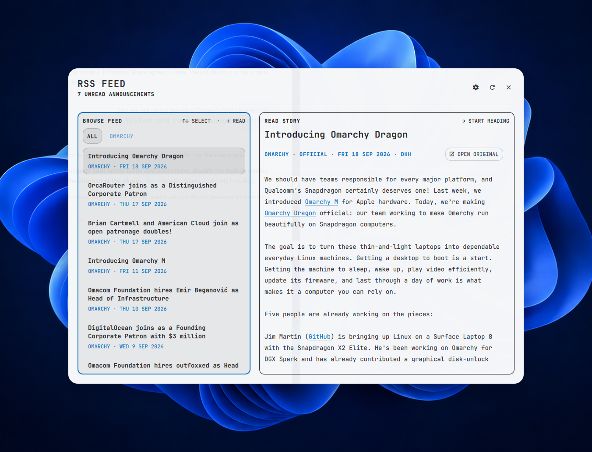

# RSS Feed

**Your feeds, at home on Omarchy.**

A desktop RSS and Atom reader for following the sources you choose. Browse headlines on the left, read the story on the right, and keep your subscriptions together in named collections. Open it from the bar or a keyboard shortcut, tiled into your workspace or floating in the centre of the screen.



## Made for everyday reading

Omarchy announcements are always within reach. Add any of the ten included technology feeds, bring your own subscriptions, and organise them around what you follow.

RSS Feed remembers what you've read, refreshes in the background and keeps cached articles available offline. It follows your Omarchy theme and works with both mouse and keyboard. When you want the publisher's full page, open the original in your browser.

I originally built this reader for Omarchy itself. It now lives as an independent plugin, so improvements can ship without waiting for a shell release. The screenshot above is the plugin running on my XPS.

## Install

For **Omarchy Quattro with plugin support**. Requires Python 3.12+ alongside Omarchy's Quickshell, Lua-enabled Hyprland, system CA certificates and coreutils. No extra Python packages or accounts.

```bash
omarchy plugin add https://github.com/tcballard/omarchy-plugin-rss-feed.git --enable
```

Click the RSS icon in your bar to open the reader. To add **Super + Alt + N**:

```bash
python3 ~/.config/omarchy/plugins/io.github.tcballard.rss-feed/scripts/keybindings.py
```

The optional shortcut setup checks for conflicts and backs up your bindings before making changes.

Already using the original built-in reader? See the [migration guide](docs/installation.md) before enabling this one.

## Make it yours

Press **F** or click the gear to manage feeds and collections. Choose **Window mode → Centred floating** for a pop-out reader, or **Tiled** to keep it in your layout. Your choice is remembered.

Use **R** to refresh, **O** to open the original article and **Esc** to go back or close. [All controls →](docs/keybindings.md)

## Update and remove

Update:

```bash
omarchy plugin update io.github.tcballard.rss-feed
omarchy-restart-shell
```

Remove the shortcut and plugin:

```bash
python3 ~/.config/omarchy/plugins/io.github.tcballard.rss-feed/scripts/keybindings.py --remove
omarchy plugin remove io.github.tcballard.rss-feed
```

Removal keeps your cached articles and reading history. See [installation and removal](docs/installation.md) for retained settings, backups and rollback.

## A few useful details

Feeds come directly from their publishers. No analytics, accounts or tracking service. Custom subscriptions need public HTTPS URLs; private-network and authenticated feeds aren't supported. Subscription URLs and cached articles are stored locally in plain text. [Privacy and dependencies →](docs/security.md)

This is the **v0.1.0 candidate**, [submitted to the Plugin Store](https://github.com/omacom/omarchy-plugin-marketplace/issues/8069). Opening and floating have been tested on my XPS; the remaining release checks are recorded in [validation](docs/validation.md).

[Report a bug](https://github.com/tcballard/omarchy-plugin-rss-feed/issues) · [Feed catalogue](docs/feed-catalog.md) · [Security reporting](SECURITY.md)

For development, run `bash test/all`. MIT licensed; the original Omarchy licence is retained. Made by [Tom Ballard](https://github.com/tcballard).
